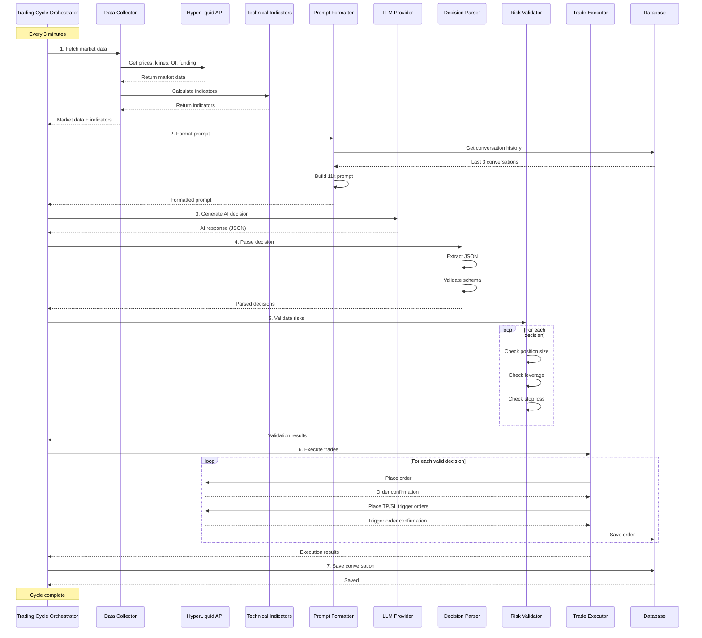
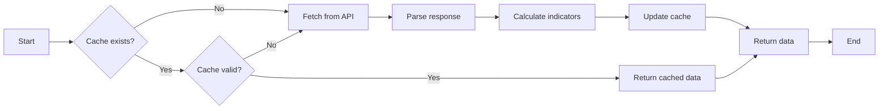
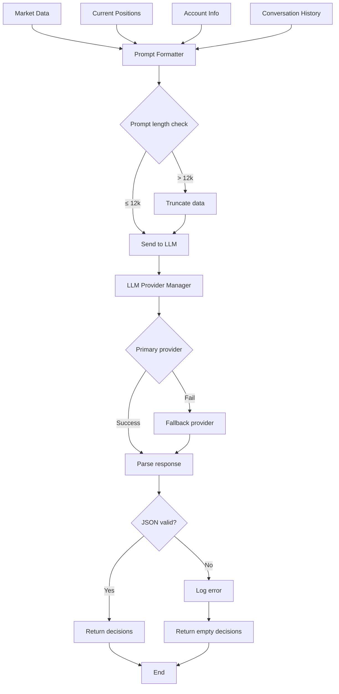
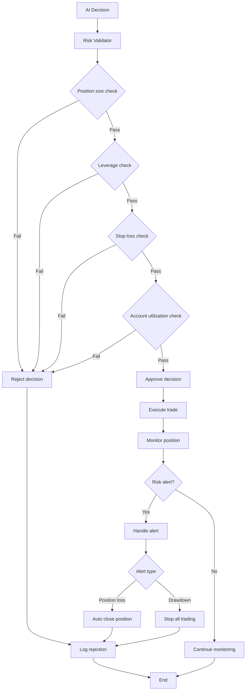
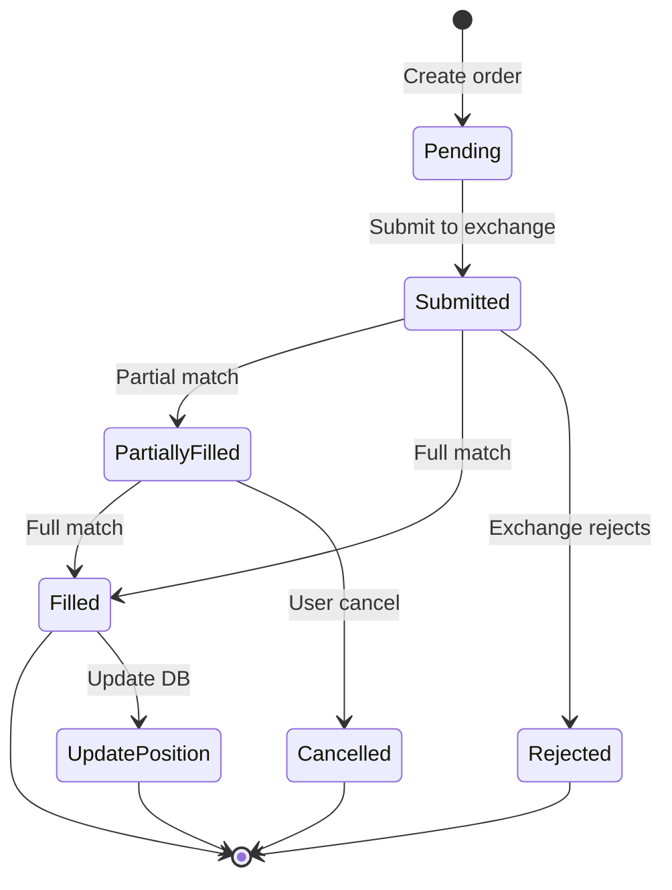
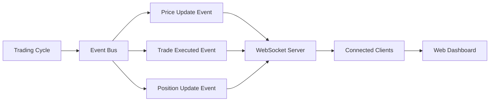
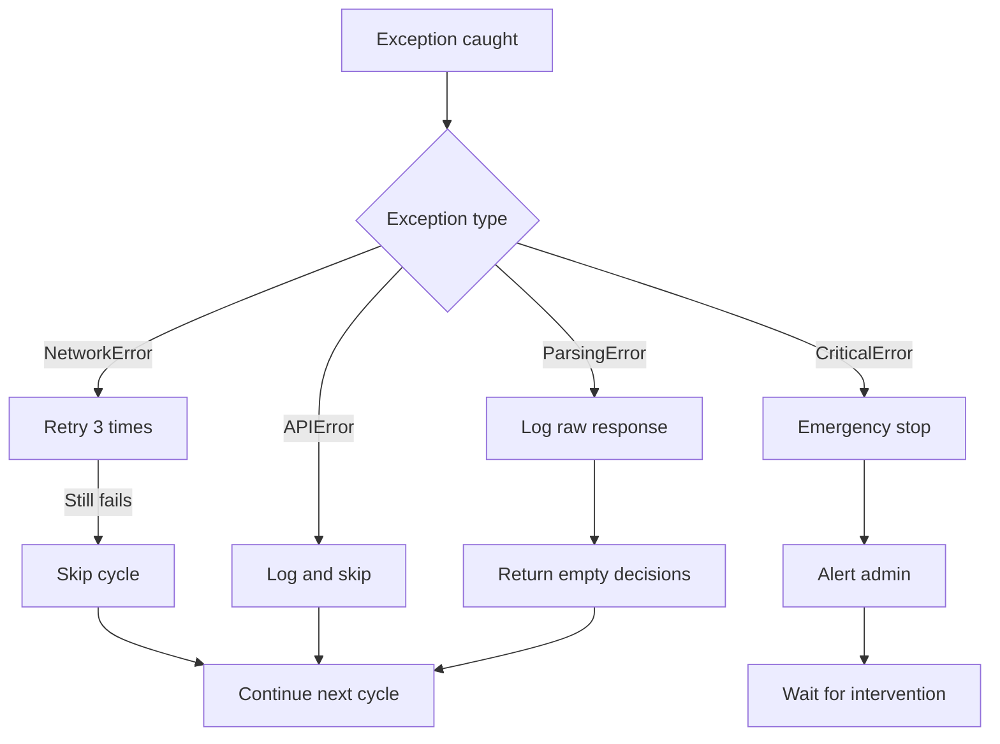
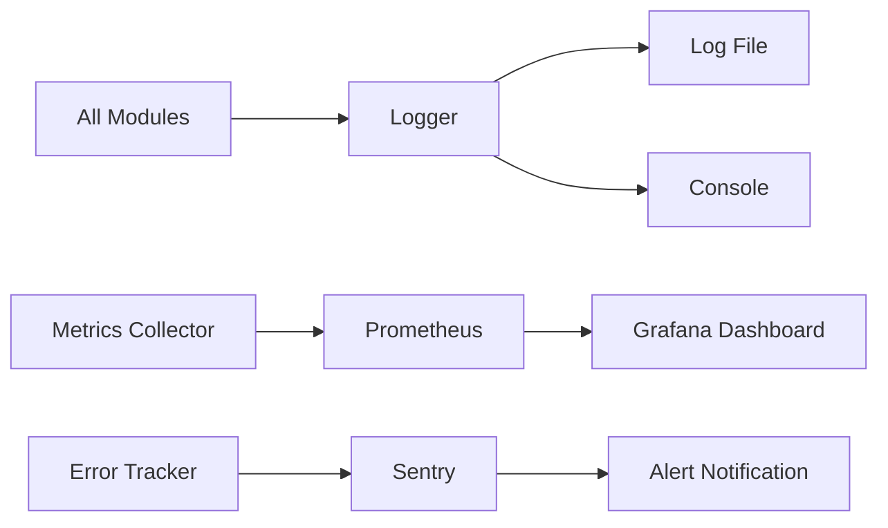

# 数据流设计

AI交易系统的数据流动和处理流程

---

## 1. 核心交易循环数据流



---

## 2. 市场数据采集流程



**数据流**:
1. 检查缓存（TTL: 60秒）
2. 缓存未命中 → 调用HyperLiquid API
3. 解析响应数据
4. 计算技术指标（pandas-ta）
5. 更新缓存
6. 返回完整数据

---

## 3. AI决策生成流程



**提示词结构**:
```
Header (时间戳, 账户状态)
    ↓
Portfolio Section (持仓, 盈亏)
    ↓
Market Section (6个币种的数据 + 指标)
    ↓
Constraints Section (风险规则)
    ↓
Conversation History (最近3轮)
    ↓
Task Section (输出格式要求)
```

---

## 4. 风险管理流程



**风险检查点**:
1. **交易前验证**:
   - 仓位大小 ≤ $2,000
   - 杠杆 ≤ 10x
   - 止损百分比 ≤ 15%
   - 账户利用率 ≤ 80%

2. **交易后监控**:
   - 每个循环检查一次
   - 单仓亏损 > 15% → 自动平仓
   - 账户回撤 > 30% → 停止所有交易

---

## 5. 订单执行流程



**执行步骤**:
1. 验证决策（风险检查）
2. 创建订单对象
3. 提交到HyperLiquid
4. 等待成交确认
5. 更新持仓记录
6. 设置止损止盈（触发单）
7. 保存到数据库

---

## 6. 数据持久化流程

### 6.1 写入流程
```
Event → Serialize → DB → Commit
```

### 6.2 数据库写入时机

| 事件 | 写入表 | 时机 |
|------|--------|------|
| AI对话完成 | `conversations` | 每次循环结束 |
| 订单创建 | `orders` | 下单成功后 |
| 订单成交 | `orders` | 收到成交回调 |
| 开仓 | `positions` | 订单完全成交后 |
| 平仓 | `positions` | 平仓订单成交后 |
| 风险事件 | `risk_events` | 触发风险规则时 |
| 状态变更 | `bot_status` | 启动/停止/异常时 |

---

## 7. WebSocket实时数据流（可选 - Phase 6）



**实时推送事件**:
- `prices`: 每3分钟推送最新价格
- `trades`: 交易执行后立即推送
- `positions`: 持仓变化时推送
- `alerts`: 风险告警立即推送

---

## 8. 错误处理和重试机制

### 8.1 API调用重试

```python
def fetch_with_retry(func, max_retries=3, backoff=2):
    for attempt in range(max_retries):
        try:
            return func()
        except (NetworkError, Timeout) as e:
            if attempt == max_retries - 1:
                raise
            wait_time = backoff ** attempt
            logger.warning(f"Retry {attempt+1}/{max_retries} after {wait_time}s: {e}")
            time.sleep(wait_time)
```

### 8.2 异常流处理



---

## 9. 性能优化

### 9.1 并发数据获取

```python
import asyncio

async def fetch_all_market_data(coins):
    tasks = [fetch_coin_data(coin) for coin in coins]
    return await asyncio.gather(*tasks)

# 6个币种并发获取，总耗时 = 单个耗时（约1-2秒）
# 串行获取总耗时 = 6 × 单个耗时（约6-12秒）
```

### 9.2 数据缓存

**缓存策略**:
- 价格数据: TTL 5秒
- K线数据: TTL 60秒（3分钟K线变化不频繁）
- OI/Funding Rate: TTL 300秒（变化缓慢）

---

## 10. 监控数据流



**监控指标**:
- 交易循环延迟
- API调用成功率
- 订单执行成功率
- 数据库写入延迟
- LLM响应时间

---

## 11. 参考
- `docs/02_architecture/system_overview.md`: 系统架构
- `docs/01_requirements/functional_requirements.md`: 功能需求
- Mermaid文档: https://mermaid.js.org/
