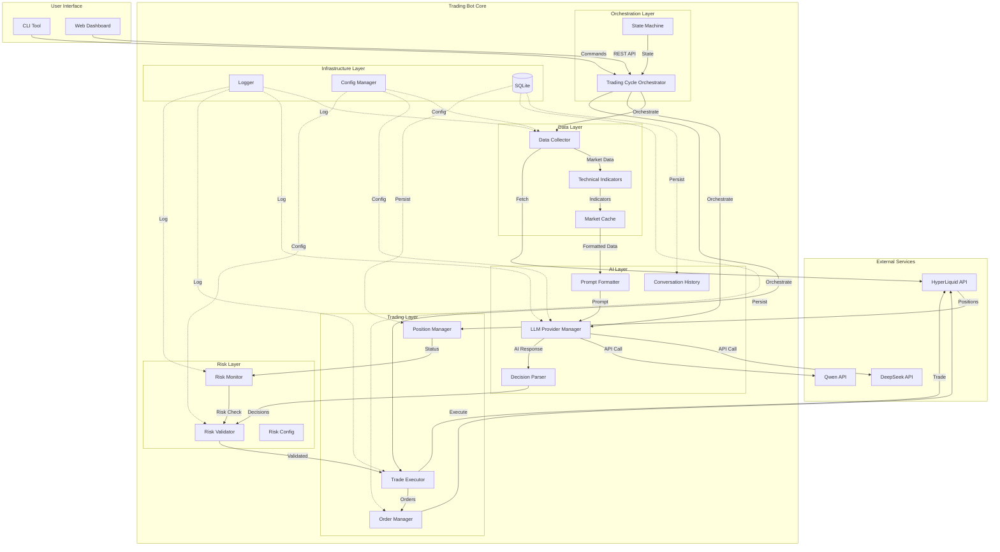

# 系统架构总览

AI交易系统的整体架构设计

---

## 1. 系统架构图



---

## 2. 核心模块设计

### 2.1 Data Layer (数据层)

#### 2.1.1 Data Collector
**职责**: 从HyperLiquid采集实时市场数据

**核心类**:
```python
class DataCollector:
    def __init__(self, config: Config):
        self.hyperliquid_client = HyperliquidClient(config.api_key)
        self.coins = config.trading.coins

    def fetch_prices(self) -> Dict[str, Price]:
        """获取实时价格"""

    def fetch_klines(self, coin: str, interval: str, limit: int) -> pd.DataFrame:
        """获取K线数据"""

    def fetch_open_interest(self, coin: str) -> float:
        """获取开放利息"""

    def fetch_funding_rate(self, coin: str) -> float:
        """获取资金费率"""
```

**依赖**:
- `hyperliquid-python-sdk` 或 REST API客户端
- `requests` 用于HTTP调用
- `pandas` 用于数据处理

---

#### 2.1.2 Technical Indicators
**职责**: 计算技术指标

**核心类**:
```python
class TechnicalIndicators:
    def __init__(self):
        pass

    def calculate_all(self, klines: pd.DataFrame) -> Dict[str, Any]:
        """计算所有指标"""
        return {
            "ema_20": self.ema(klines, 20),
            "ema_50": self.ema(klines, 50),
            "macd": self.macd(klines),
            "rsi_7": self.rsi(klines, 7),
            "rsi_14": self.rsi(klines, 14),
            "atr_3": self.atr(klines, 3),
            "atr_14": self.atr(klines, 14),
        }

    def ema(self, klines: pd.DataFrame, period: int) -> float:
        """计算EMA"""

    def macd(self, klines: pd.DataFrame) -> Dict[str, float]:
        """计算MACD"""

    def rsi(self, klines: pd.DataFrame, period: int) -> float:
        """计算RSI"""

    def atr(self, klines: pd.DataFrame, period: int) -> float:
        """计算ATR"""
```

**依赖**:
- `pandas-ta` 用于技术指标计算

---

#### 2.1.3 Market Cache
**职责**: 缓存市场数据，避免重复API调用

**核心类**:
```python
class MarketCache:
    def __init__(self, ttl_seconds: int = 60):
        self.cache: Dict[str, CacheEntry] = {}
        self.ttl = ttl_seconds

    def get(self, key: str) -> Optional[Any]:
        """获取缓存"""

    def set(self, key: str, value: Any) -> None:
        """设置缓存"""

    def invalidate(self, key: str) -> None:
        """清除缓存"""
```

---

### 2.2 AI Layer (AI决策层)

#### 2.2.1 Prompt Formatter
**职责**: 格式化市场数据为LLM提示词

**核心类**:
```python
class PromptFormatter:
    def format(
        self,
        market_data: Dict[str, MarketData],
        positions: List[Position],
        account: AccountInfo,
        conversation_history: List[Message]
    ) -> str:
        """
        格式化为11k字符的提示词
        参考 docs/00_research/nof1_ai_system_prompts_and_outputs.md
        """
        prompt = self._build_header()
        prompt += self._build_portfolio_section(positions, account)
        prompt += self._build_market_section(market_data)
        prompt += self._build_constraints_section()
        prompt += self._build_conversation_section(conversation_history)
        prompt += self._build_task_section()
        return prompt
```

---

#### 2.2.2 LLM Provider Manager
**职责**: 管理多个LLM Provider，支持切换和故障转移

**核心类**:
```python
class LLMProviderManager:
    def __init__(self, config: LLMConfig):
        self.primary = self._create_provider(config.primary_provider)
        self.fallback = self._create_provider(config.fallback_provider)

    def generate_decision(self, prompt: str) -> str:
        """调用LLM生成决策"""
        try:
            return self.primary.generate(prompt)
        except Exception as e:
            logger.warning(f"Primary provider failed: {e}, switching to fallback")
            return self.fallback.generate(prompt)

    def _create_provider(self, name: str) -> LLMProvider:
        """工厂方法创建Provider"""
        if name == "deepseek":
            return DeepSeekProvider(...)
        elif name == "qwen":
            return QwenProvider(...)
        elif name == "openrouter":
            return OpenRouterProvider(...)

class LLMProvider(ABC):
    @abstractmethod
    def generate(self, prompt: str) -> str:
        """生成AI回复"""

class DeepSeekProvider(LLMProvider):
    def generate(self, prompt: str) -> str:
        response = requests.post(
            "https://api.deepseek.com/v1/chat/completions",
            headers={"Authorization": f"Bearer {self.api_key}"},
            json={
                "model": "deepseek-chat",
                "messages": [{"role": "user", "content": prompt}],
                "max_tokens": 4000,
                "temperature": 0.7
            }
        )
        return response.json()["choices"][0]["message"]["content"]
```

---

#### 2.2.3 Decision Parser
**职责**: 解析AI返回的JSON决策

**核心类**:
```python
from pydantic import BaseModel, Field
from typing import Literal

class Decision(BaseModel):
    coin: str
    action: Literal["OPEN_LONG", "OPEN_SHORT", "CLOSE", "HOLD", "ADJUST_SL", "ADJUST_TP"]
    position_size_usd: Optional[float] = None
    leverage: Optional[int] = None
    entry_price: Optional[float] = None
    stop_loss: Optional[float] = None
    take_profit: Optional[float] = None
    reasoning: str

class AIDecisions(BaseModel):
    decisions: List[Decision]
    risk_assessment: str
    market_sentiment: str

class DecisionParser:
    def parse(self, ai_response: str) -> AIDecisions:
        """解析AI返回的JSON"""
        try:
            # 提取JSON部分（AI可能返回Markdown格式）
            json_str = self._extract_json(ai_response)
            data = json.loads(json_str)
            return AIDecisions(**data)
        except Exception as e:
            logger.error(f"Failed to parse AI decision: {e}")
            logger.error(f"Raw response: {ai_response}")
            raise

    def _extract_json(self, text: str) -> str:
        """从Markdown中提取JSON"""
        # 处理 ```json ... ``` 格式
        if "```json" in text:
            start = text.find("```json") + 7
            end = text.find("```", start)
            return text[start:end].strip()
        return text
```

---

### 2.3 Trading Layer (交易层)

#### 2.3.1 Trade Executor
**职责**: 执行交易决策

**核心类**:
```python
class TradeExecutor:
    def __init__(self, exchange_client: HyperliquidClient, risk_validator: RiskValidator):
        self.exchange = exchange_client
        self.risk_validator = risk_validator

    def execute_decisions(self, decisions: List[Decision]) -> List[ExecutionResult]:
        """执行所有交易决策"""
        results = []
        for decision in decisions:
            if decision.action == "HOLD":
                continue

            # 风险检查
            if not self.risk_validator.validate(decision):
                logger.warning(f"Risk check failed for {decision.coin}")
                continue

            # 执行交易
            result = self._execute_single(decision)
            results.append(result)

        return results

    def _execute_single(self, decision: Decision) -> ExecutionResult:
        """执行单个交易"""
        if decision.action == "OPEN_LONG":
            return self._open_position(decision, "BUY")
        elif decision.action == "OPEN_SHORT":
            return self._open_position(decision, "SELL")
        elif decision.action == "CLOSE":
            return self._close_position(decision.coin)
        # ... 其他action
```

---

#### 2.3.2 Order Manager
**职责**: 管理订单生命周期

**核心类**:
```python
class OrderManager:
    def __init__(self, exchange_client: HyperliquidClient):
        self.exchange = exchange_client
        self.active_orders: Dict[str, Order] = {}

    def place_order(
        self,
        coin: str,
        side: str,
        size: float,
        order_type: str = "MARKET",
        price: Optional[float] = None
    ) -> Order:
        """下单"""
        order = self.exchange.place_order(...)
        self.active_orders[order.id] = order
        return order

    def get_order_status(self, order_id: str) -> OrderStatus:
        """查询订单状态"""

    def cancel_order(self, order_id: str) -> bool:
        """取消订单"""
```

---

#### 2.3.3 Position Manager
**职责**: 管理持仓状态

**核心类**:
```python
class PositionManager:
    def __init__(self, exchange_client: HyperliquidClient):
        self.exchange = exchange_client

    def get_positions(self) -> List[Position]:
        """获取当前所有持仓"""

    def get_position(self, coin: str) -> Optional[Position]:
        """获取指定币种的持仓"""

    def set_stop_loss_take_profit(
        self,
        coin: str,
        stop_loss: float,
        take_profit: float
    ) -> bool:
        """设置止损止盈"""
```

---

### 2.4 Risk Layer (风险管理层)

#### 2.4.1 Risk Validator
**职责**: 交易前风险验证

**核心类**:
```python
class RiskValidator:
    def __init__(self, config: RiskConfig, position_manager: PositionManager):
        self.config = config
        self.position_manager = position_manager

    def validate(self, decision: Decision) -> bool:
        """验证交易决策是否符合风险规则"""
        checks = [
            self._check_position_size(decision),
            self._check_leverage(decision),
            self._check_stop_loss(decision),
            self._check_account_utilization(decision),
        ]
        return all(checks)

    def _check_position_size(self, decision: Decision) -> bool:
        """检查仓位大小"""
        if decision.position_size_usd > self.config.max_position_size_usd:
            logger.warning(f"Position size {decision.position_size_usd} exceeds limit")
            return False
        return True

    def _check_leverage(self, decision: Decision) -> bool:
        """检查杠杆"""
        if decision.leverage > self.config.max_leverage:
            logger.warning(f"Leverage {decision.leverage} exceeds limit")
            return False
        return True

    def _check_stop_loss(self, decision: Decision) -> bool:
        """检查止损设置"""
        if not decision.stop_loss:
            logger.warning("No stop loss set")
            return False

        sl_pct = abs(decision.entry_price - decision.stop_loss) / decision.entry_price
        if sl_pct > self.config.stop_loss_pct:
            logger.warning(f"Stop loss {sl_pct:.2%} exceeds limit")
            return False
        return True
```

---

#### 2.4.2 Risk Monitor
**职责**: 运行时风险监控

**核心类**:
```python
class RiskMonitor:
    def __init__(self, config: RiskConfig, position_manager: PositionManager):
        self.config = config
        self.position_manager = position_manager

    def check_all_risks(self) -> List[RiskAlert]:
        """检查所有风险"""
        alerts = []

        # 检查单仓位风险
        for position in self.position_manager.get_positions():
            if position.unrealized_pnl_pct < -self.config.stop_loss_pct:
                alerts.append(RiskAlert(
                    level="CRITICAL",
                    message=f"{position.coin} loss {position.unrealized_pnl_pct:.2%} exceeds limit",
                    action="AUTO_CLOSE"
                ))

        # 检查账户风险
        account_drawdown = self._calculate_drawdown()
        if account_drawdown < -self.config.max_drawdown_pct:
            alerts.append(RiskAlert(
                level="CRITICAL",
                message=f"Account drawdown {account_drawdown:.2%} exceeds limit",
                action="STOP_TRADING"
            ))

        return alerts

    def handle_alerts(self, alerts: List[RiskAlert]) -> None:
        """处理风险告警"""
        for alert in alerts:
            logger.error(f"Risk alert: {alert.message}")
            if alert.action == "AUTO_CLOSE":
                # 自动平仓
                pass
            elif alert.action == "STOP_TRADING":
                # 停止交易
                pass
```

---

### 2.5 Orchestration Layer (编排层)

#### 2.5.1 Trading Cycle Orchestrator
**职责**: 协调整个交易循环

**核心类**:
```python
class TradingCycleOrchestrator:
    def __init__(
        self,
        data_collector: DataCollector,
        technical_indicators: TechnicalIndicators,
        llm_manager: LLMProviderManager,
        prompt_formatter: PromptFormatter,
        decision_parser: DecisionParser,
        trade_executor: TradeExecutor,
        risk_monitor: RiskMonitor,
        position_manager: PositionManager,
    ):
        self.data_collector = data_collector
        self.indicators = technical_indicators
        self.llm = llm_manager
        self.prompt_formatter = prompt_formatter
        self.parser = decision_parser
        self.executor = trade_executor
        self.risk_monitor = risk_monitor
        self.position_manager = position_manager
        self.cycle_count = 0

    def run_cycle(self) -> CycleResult:
        """执行一次完整的交易循环"""
        self.cycle_count += 1
        logger.info(f"Starting trading cycle #{self.cycle_count}")

        try:
            # 1. 采集市场数据
            market_data = self._collect_market_data()

            # 2. 获取当前持仓
            positions = self.position_manager.get_positions()

            # 3. 检查风险
            risk_alerts = self.risk_monitor.check_all_risks()
            if risk_alerts:
                self.risk_monitor.handle_alerts(risk_alerts)
                return CycleResult(status="RISK_ALERT", alerts=risk_alerts)

            # 4. 生成AI决策
            prompt = self.prompt_formatter.format(market_data, positions, ...)
            ai_response = self.llm.generate_decision(prompt)
            decisions = self.parser.parse(ai_response)

            # 5. 执行交易
            results = self.executor.execute_decisions(decisions.decisions)

            logger.info(f"Cycle #{self.cycle_count} completed: {len(results)} trades executed")
            return CycleResult(status="SUCCESS", trades=results)

        except Exception as e:
            logger.error(f"Cycle #{self.cycle_count} failed: {e}", exc_info=True)
            return CycleResult(status="ERROR", error=str(e))

    def _collect_market_data(self) -> Dict[str, MarketData]:
        """采集所有币种的市场数据"""
        market_data = {}
        for coin in ["BTC", "ETH", "SOL", "BNB", "DOGE", "XRP"]:
            # 获取价格
            price = self.data_collector.fetch_prices()[coin]

            # 获取K线
            klines_3m = self.data_collector.fetch_klines(coin, "3m", 100)
            klines_4h = self.data_collector.fetch_klines(coin, "4h", 100)

            # 计算指标
            indicators_3m = self.indicators.calculate_all(klines_3m)
            indicators_4h = self.indicators.calculate_all(klines_4h)

            # 获取OI和资金费率
            oi = self.data_collector.fetch_open_interest(coin)
            funding = self.data_collector.fetch_funding_rate(coin)

            market_data[coin] = MarketData(
                price=price,
                klines_3m=klines_3m,
                klines_4h=klines_4h,
                indicators_3m=indicators_3m,
                indicators_4h=indicators_4h,
                open_interest=oi,
                funding_rate=funding
            )

        return market_data
```

---

#### 2.5.2 State Machine
**职责**: 管理系统状态

**状态定义**:
```python
from enum import Enum

class BotState(Enum):
    STOPPED = "stopped"
    STARTING = "starting"
    RUNNING = "running"
    PAUSED = "paused"
    ERROR = "error"
    EMERGENCY_STOP = "emergency_stop"

class StateMachine:
    def __init__(self):
        self.state = BotState.STOPPED

    def transition(self, new_state: BotState) -> bool:
        """状态转换"""
        valid_transitions = {
            BotState.STOPPED: [BotState.STARTING],
            BotState.STARTING: [BotState.RUNNING, BotState.ERROR],
            BotState.RUNNING: [BotState.PAUSED, BotState.STOPPED, BotState.EMERGENCY_STOP],
            BotState.PAUSED: [BotState.RUNNING, BotState.STOPPED],
            BotState.ERROR: [BotState.STOPPED],
            BotState.EMERGENCY_STOP: [BotState.STOPPED],
        }

        if new_state in valid_transitions.get(self.state, []):
            logger.info(f"State transition: {self.state} -> {new_state}")
            self.state = new_state
            return True
        else:
            logger.warning(f"Invalid state transition: {self.state} -> {new_state}")
            return False
```

---

### 2.6 Infrastructure Layer (基础设施层)

#### 2.6.1 Logger
**职责**: 日志管理

**配置**:
```python
from loguru import logger

def setup_logger(config: LoggingConfig):
    logger.remove()  # 移除默认handler

    # 控制台输出
    logger.add(
        sys.stdout,
        level=config.level,
        format="<green>{time:YYYY-MM-DD HH:mm:ss.SSS}</green> | <level>{level: <8}</level> | <cyan>{name}</cyan>:<cyan>{function}</cyan> | <level>{message}</level>"
    )

    # 文件输出
    logger.add(
        config.file,
        rotation=config.rotation,
        retention=config.retention,
        level=config.level,
        format="{time:YYYY-MM-DD HH:mm:ss.SSS} | {level: <8} | {name}:{function} | {message}"
    )
```

---

#### 2.6.2 Config Manager
**职责**: 配置管理

**核心类**:
```python
from pydantic import BaseModel
import yaml

class ExchangeConfig(BaseModel):
    name: str
    api_key: str
    api_secret: str
    testnet: bool = True

class LLMProviderConfig(BaseModel):
    api_key: str
    model: str
    max_tokens: int = 4000

class LLMConfig(BaseModel):
    primary_provider: str
    fallback_provider: str
    deepseek: LLMProviderConfig
    qwen: LLMProviderConfig

class TradingConfig(BaseModel):
    coins: List[str]
    cycle_interval_minutes: int = 3
    enable_auto_trading: bool = True

class RiskConfig(BaseModel):
    max_position_size_usd: float
    max_account_utilization: float
    max_leverage: int
    stop_loss_pct: float
    max_drawdown_pct: float

class Config(BaseModel):
    exchange: ExchangeConfig
    llm: LLMConfig
    trading: TradingConfig
    risk: RiskConfig
    logging: LoggingConfig

class ConfigManager:
    @staticmethod
    def load(path: str = "config.yaml") -> Config:
        """从文件加载配置"""
        with open(path) as f:
            data = yaml.safe_load(f)

        # 替换环境变量
        data = ConfigManager._substitute_env_vars(data)

        return Config(**data)

    @staticmethod
    def _substitute_env_vars(data: dict) -> dict:
        """替换 ${ENV_VAR} 格式的环境变量"""
        import os
        import re

        def replace(value):
            if isinstance(value, str):
                pattern = r'\$\{([^}]+)\}'
                matches = re.findall(pattern, value)
                for match in matches:
                    env_value = os.getenv(match, "")
                    value = value.replace(f"${{{match}}}", env_value)
            elif isinstance(value, dict):
                return {k: replace(v) for k, v in value.items()}
            elif isinstance(value, list):
                return [replace(v) for v in value]
            return value

        return replace(data)
```

---

#### 2.6.3 Database (SQLite)
**职责**: 数据持久化

**表设计**:
```sql
-- conversations: AI对话历史
CREATE TABLE conversations (
    id INTEGER PRIMARY KEY AUTOINCREMENT,
    timestamp DATETIME NOT NULL,
    prompt TEXT NOT NULL,
    response TEXT NOT NULL,
    decisions JSON,
    created_at DATETIME DEFAULT CURRENT_TIMESTAMP
);

-- orders: 订单历史
CREATE TABLE orders (
    id INTEGER PRIMARY KEY AUTOINCREMENT,
    order_id TEXT UNIQUE NOT NULL,
    coin TEXT NOT NULL,
    side TEXT NOT NULL,
    order_type TEXT NOT NULL,
    size REAL NOT NULL,
    price REAL,
    status TEXT NOT NULL,
    created_at DATETIME DEFAULT CURRENT_TIMESTAMP,
    filled_at DATETIME
);

-- positions: 持仓历史
CREATE TABLE positions (
    id INTEGER PRIMARY KEY AUTOINCREMENT,
    coin TEXT NOT NULL,
    side TEXT NOT NULL,
    entry_price REAL NOT NULL,
    exit_price REAL,
    size REAL NOT NULL,
    realized_pnl REAL,
    opened_at DATETIME NOT NULL,
    closed_at DATETIME
);

-- risk_events: 风险事件
CREATE TABLE risk_events (
    id INTEGER PRIMARY KEY AUTOINCREMENT,
    event_type TEXT NOT NULL,
    severity TEXT NOT NULL,
    message TEXT NOT NULL,
    action_taken TEXT,
    created_at DATETIME DEFAULT CURRENT_TIMESTAMP
);
```

---

## 3. 技术栈选择

### 3.1 核心依赖

```toml
[tool.poetry.dependencies]
python = "^3.8"

# 交易所
hyperliquid-python-sdk = "^0.1.0"  # 或直接使用requests

# 数据处理
pandas = "^2.0.0"
numpy = "^1.24.0"
pandas-ta = "^0.3.14"

# LLM
requests = "^2.31.0"
openai = "^1.0.0"  # 用于OpenRouter

# 配置和验证
pydantic = "^2.0.0"
pyyaml = "^6.0"
python-dotenv = "^1.0.0"

# 日志
loguru = "^0.7.0"

# CLI
click = "^8.1.0"
rich = "^13.0.0"  # 美化CLI输出

# 调度
schedule = "^1.2.0"

# 数据库
sqlalchemy = "^2.0.0"

# Web (可选 - Phase 6)
fastapi = "^0.100.0"
uvicorn = "^0.23.0"
```

### 3.2 开发依赖

```toml
[tool.poetry.dev-dependencies]
pytest = "^7.4.0"
pytest-cov = "^4.1.0"
pytest-mock = "^3.11.0"
black = "^23.7.0"
pylint = "^2.17.0"
mypy = "^1.5.0"
```

---

## 4. 项目结构

```
hyper-demo/
├── src/
│   └── trading_bot/
│       ├── __init__.py
│       ├── main.py                    # 入口
│       ├── config.py                  # 配置管理
│       │
│       ├── data/                      # 数据层
│       │   ├── __init__.py
│       │   ├── collector.py           # DataCollector
│       │   ├── indicators.py          # TechnicalIndicators
│       │   └── cache.py               # MarketCache
│       │
│       ├── ai/                        # AI层
│       │   ├── __init__.py
│       │   ├── formatter.py           # PromptFormatter
│       │   ├── providers.py           # LLM Providers
│       │   ├── parser.py              # DecisionParser
│       │   └── history.py             # ConversationHistory
│       │
│       ├── trading/                   # 交易层
│       │   ├── __init__.py
│       │   ├── executor.py            # TradeExecutor
│       │   ├── order_manager.py       # OrderManager
│       │   └── position_manager.py    # PositionManager
│       │
│       ├── risk/                      # 风险层
│       │   ├── __init__.py
│       │   ├── validator.py           # RiskValidator
│       │   └── monitor.py             # RiskMonitor
│       │
│       ├── orchestration/             # 编排层
│       │   ├── __init__.py
│       │   ├── orchestrator.py        # TradingCycleOrchestrator
│       │   └── state_machine.py       # StateMachine
│       │
│       ├── infrastructure/            # 基础设施
│       │   ├── __init__.py
│       │   ├── logger.py              # Logger setup
│       │   └── database.py            # Database
│       │
│       ├── cli/                       # CLI工具
│       │   ├── __init__.py
│       │   └── commands.py            # Click commands
│       │
│       └── models/                    # 数据模型
│           ├── __init__.py
│           ├── market.py              # MarketData, Price, etc.
│           ├── decision.py            # Decision, AIDecisions
│           ├── order.py               # Order, Position
│           └── risk.py                # RiskAlert, etc.
│
├── tests/                             # 测试
│   ├── unit/
│   ├── integration/
│   └── e2e/
│
├── config.yaml                        # 配置文件
├── .env.example                       # 环境变量示例
├── pyproject.toml                     # Poetry配置
├── README.md
└── ROADMAP.md
```

---

## 5. 部署架构

### 5.1 开发环境
- 本地运行
- HyperLiquid测试网
- SQLite数据库

### 5.2 生产环境
- VPS (如Vultr, DigitalOcean)
- Ubuntu 22.04 LTS
- Systemd service管理
- PostgreSQL (可选)
- Nginx反向代理 (如果有Web界面)

**Systemd配置示例**:
```ini
[Unit]
Description=AI Trading Bot
After=network.target

[Service]
Type=simple
User=trading
WorkingDirectory=/home/trading/hyper-demo
Environment="PATH=/home/trading/hyper-demo/.venv/bin"
ExecStart=/home/trading/hyper-demo/.venv/bin/python -m trading_bot.main
Restart=always
RestartSec=10

[Install]
WantedBy=multi-user.target
```

---

## 6. 安全考虑

### 6.1 API密钥管理
- 使用环境变量存储敏感信息
- 生产环境使用加密配置文件或密钥管理服务（如AWS Secrets Manager）
- 日志中自动隐藏API密钥

### 6.2 交易安全
- 强制风险管理规则
- 交易前双重验证
- 异常时紧急停止机制

### 6.3 网络安全
- Web界面启用HTTPS
- API认证（JWT或API Key）
- 防火墙配置

---

## 7. 监控和告警

### 7.1 监控指标
- 系统运行时间
- 交易循环成功率
- API调用延迟
- 订单执行成功率
- 账户余额和盈亏
- 风险事件次数

### 7.2 告警机制
- 日志文件（ERROR级别）
- Telegram通知（可选）
- Email通知（可选）

---

## 8. 参考文档

- `docs/00_research/implementation_approaches.md`: 技术选型
- `docs/01_requirements/functional_requirements.md`: 功能需求
- `.claude/architecture_decisions.md`: 架构决策记录
- `.claude/code_standards.md`: 代码规范
