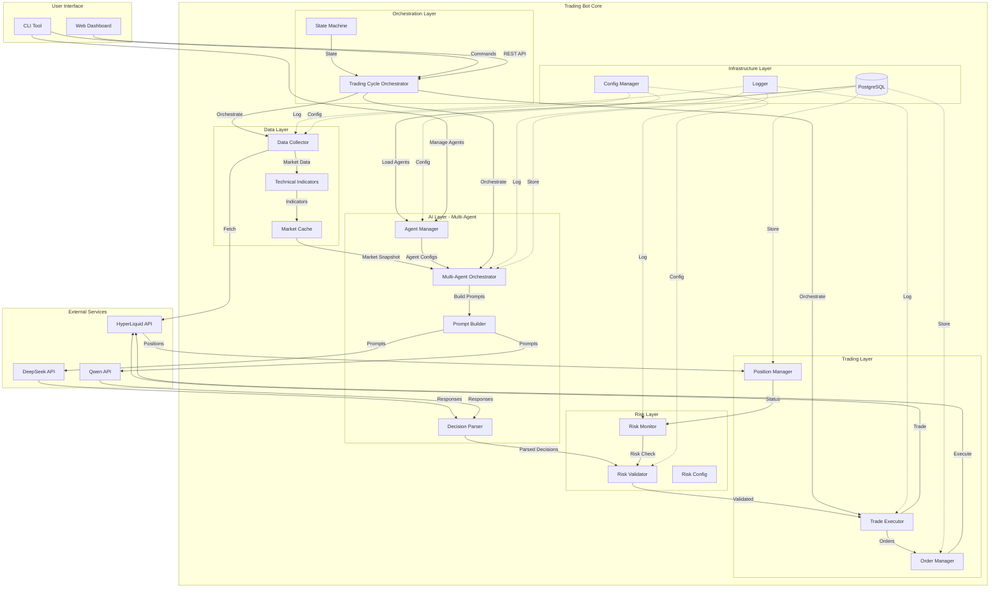

# 系统架构总览

AI交易系统的整体架构设计

---

## 1. 系统架构图



---

## 2. 核心模块设计

### 2.1 Data Layer (数据层)

#### 2.1.1 Data Collector
**职责**: 从HyperLiquid采集实时市场数据

**核心类**:
```python
class DataCollector:
    def __init__(self, config: Config):
        self.hyperliquid_client = HyperliquidClient(config.api_key)
        self.coins = config.trading.coins

    def fetch_prices(self) -> Dict[str, Price]:
        """获取实时价格"""

    def fetch_klines(self, coin: str, interval: str, limit: int) -> pd.DataFrame:
        """获取K线数据"""

    def fetch_open_interest(self, coin: str) -> float:
        """获取开放利息"""

    def fetch_funding_rate(self, coin: str) -> float:
        """获取资金费率"""
```

**依赖**:
- `hyperliquid-python-sdk` 或 REST API客户端
- `requests` 用于HTTP调用
- `pandas` 用于数据处理

---

#### 2.1.2 Technical Indicators
**职责**: 计算技术指标

**核心类**:
```python
class TechnicalIndicators:
    def __init__(self):
        pass

    def calculate_all(self, klines: pd.DataFrame) -> Dict[str, Any]:
        """计算所有指标"""
        return {
            "ema_20": self.ema(klines, 20),
            "ema_50": self.ema(klines, 50),
            "macd": self.macd(klines),
            "rsi_7": self.rsi(klines, 7),
            "rsi_14": self.rsi(klines, 14),
            "atr_3": self.atr(klines, 3),
            "atr_14": self.atr(klines, 14),
        }

    def ema(self, klines: pd.DataFrame, period: int) -> float:
        """计算EMA"""

    def macd(self, klines: pd.DataFrame) -> Dict[str, float]:
        """计算MACD"""

    def rsi(self, klines: pd.DataFrame, period: int) -> float:
        """计算RSI"""

    def atr(self, klines: pd.DataFrame, period: int) -> float:
        """计算ATR"""
```

**依赖**:
- `pandas-ta` 用于技术指标计算

---

#### 2.1.3 Market Cache
**职责**: 缓存市场数据，避免重复API调用

**核心类**:
```python
class MarketCache:
    def __init__(self, ttl_seconds: int = 60):
        self.cache: Dict[str, CacheEntry] = {}
        self.ttl = ttl_seconds

    def get(self, key: str) -> Optional[Any]:
        """获取缓存"""

    def set(self, key: str, value: Any) -> None:
        """设置缓存"""

    def invalidate(self, key: str) -> None:
        """清除缓存"""
```

---

### 2.2 AI Layer (AI决策层)

#### 2.2.1 Agent Manager
**职责**: 管理多个trading agents，从数据库加载配置，为每个agent创建LLM provider

**设计原则**:
- 每个agent = 1个LLM模型 + 1个独立HyperLiquid账户
- Agent配置存储在数据库（trading_agents表）
- 支持动态启动/暂停/停止agents
- 多个agents可使用相同或不同的LLM模型

**核心类**:
```python
from sqlalchemy.orm import Session
from typing import List, Dict
from src.trading_bot.models.database import TradingAgent

class AgentManager:
    """管理所有trading agents"""

    def __init__(self, db_session: Session, llm_config: LLMConfig):
        self.db = db_session
        self.llm_config = llm_config
        self.agents: List[TradingAgent] = []
        self.providers: Dict[str, BaseLLMProvider] = {}
        self._load_active_agents()

    def _load_active_agents(self):
        """从数据库加载活跃的agents"""
        self.agents = self.db.query(TradingAgent)\
            .filter(TradingAgent.status == 'active')\
            .all()

        logger.info(f"Loaded {len(self.agents)} active agents")

        # 为每个agent创建对应的LLM provider
        for agent in self.agents:
            if agent.llm_model not in self.providers:
                self.providers[agent.llm_model] = self._create_provider(agent.llm_model)

    def _create_provider(self, model_name: str) -> BaseLLMProvider:
        """为指定模型创建LLM provider"""
        if model_name not in self.llm_config.models:
            raise ValueError(f"Model {model_name} not found in config")

        model_config = self.llm_config.models[model_name]
        provider_type = model_config.provider

        if provider_type == "official":
            provider_config = model_config.official
            return OfficialAPIProvider(
                api_key=provider_config.api_key,
                base_url=provider_config.base_url,
                model_name=provider_config.model_name,
                timeout=provider_config.timeout
            )
        elif provider_type == "openrouter":
            provider_config = model_config.openrouter
            return OpenRouterProvider(
                api_key=provider_config.api_key,
                base_url=provider_config.base_url,
                model_name=provider_config.model_name,
                timeout=provider_config.timeout
            )

    def get_provider(self, agent: TradingAgent) -> BaseLLMProvider:
        """获取agent对应的LLM provider"""
        return self.providers[agent.llm_model]

    def reload_agents(self):
        """重新加载agents（支持运行时添加/删除agents）"""
        self._load_active_agents()
```

---

#### 2.2.2 Multi-Agent Orchestrator
**职责**: 协调多个agents的并行决策和执行

**核心类**:
```python
import asyncio
from typing import List, Dict
from datetime import datetime

class MultiAgentOrchestrator:
    """多agent并行决策协调器"""

    def __init__(
        self,
        agent_manager: AgentManager,
        data_collector: DataCollector,
        prompt_builder: PromptBuilder,
        decision_parser: DecisionParser,
        db_session: Session
    ):
        self.agent_manager = agent_manager
        self.data_collector = data_collector
        self.prompt_builder = prompt_builder
        self.parser = decision_parser
        self.db = db_session

    async def run_decision_cycle(self) -> List[AgentDecision]:
        """运行一次完整的多agent决策周期"""

        # 1. 采集市场数据（所有agents共享）
        logger.info("Collecting market data...")
        market_data = self.data_collector.collect_all()

        # 2. 并行调用所有agents的LLM决策
        logger.info(f"Generating decisions for {len(self.agent_manager.agents)} agents...")
        tasks = []
        for agent in self.agent_manager.agents:
            task = self._generate_agent_decision(agent, market_data)
            tasks.append(task)

        # 并行执行所有LLM调用
        decisions = await asyncio.gather(*tasks, return_exceptions=True)

        # 3. 处理结果并保存到数据库
        saved_decisions = []
        for agent, decision in zip(self.agent_manager.agents, decisions):
            if isinstance(decision, Exception):
                logger.error(f"Agent {agent.name} failed: {decision}")
                continue

            # 保存decision到数据库
            db_decision = AgentDecision(
                agent_id=agent.id,
                market_data_snapshot=market_data,
                llm_prompt=decision['prompt'],
                llm_response=decision['response'],
                parsed_decision=decision['parsed'],
                created_at=datetime.utcnow()
            )
            self.db.add(db_decision)
            saved_decisions.append(db_decision)

        self.db.commit()
        logger.info(f"Completed decision cycle: {len(saved_decisions)} successful decisions")

        return saved_decisions

    async def _generate_agent_decision(
        self,
        agent: TradingAgent,
        market_data: Dict
    ) -> Dict:
        """为单个agent生成决策（异步）"""

        # 获取agent的持仓信息
        positions = self._get_agent_positions(agent)

        # 构建prompt
        prompt = self.prompt_builder.build(
            market_data=market_data,
            positions=positions,
            agent=agent
        )

        # 调用LLM（异步）
        provider = self.agent_manager.get_provider(agent)
        response = await provider.generate_async(
            prompt,
            max_tokens=self.agent_manager.llm_config.max_tokens,
            temperature=self.agent_manager.llm_config.temperature
        )

        # 解析决策
        parsed = self.parser.parse(response)

        return {
            'prompt': prompt,
            'response': response,
            'parsed': parsed
        }

    def _get_agent_positions(self, agent: TradingAgent) -> List[Position]:
        """获取agent的当前持仓"""
        # TODO: 从HyperLiquid API获取agent账户的持仓
        pass
```

---

#### 2.2.3 Prompt Builder
**职责**: 为每个agent构建个性化的LLM提示词

**核心类**:
```python
class PromptBuilder:
    def build(
        self,
        market_data: Dict[str, MarketData],
        positions: List[Position],
        agent: TradingAgent
    ) -> str:
        """
        构建NoF1.ai风格的提示词
        参考 docs/00_research/nof1_ai_system_prompts_and_outputs.md
        """
        prompt = self._build_header(agent)
        prompt += self._build_portfolio_section(positions, agent)
        prompt += self._build_market_section(market_data)
        prompt += self._build_constraints_section(agent)
        prompt += self._build_task_section()
        return prompt

    def _build_header(self, agent: TradingAgent) -> str:
        """构建header部分（agent身份）"""
        return f"""You are {agent.name}, an AI trading agent on HyperLiquid.
Your account: {agent.hyperliquid_account_id}
Your balance: ${agent.current_balance_usd:.2f}
"""
```

---

#### 2.2.4 LLM Provider (Base Classes)
**职责**: 抽象LLM服务提供商，支持多种API

**设计原则**: Model-Centric（模型优先）
- 每个模型可通过不同服务提供商访问（Official API, OpenRouter等）
- 支持同步和异步调用
- 统一的接口设计

**核心类**:
```python
from abc import ABC, abstractmethod
from typing import Dict, Optional
import asyncio

class BaseLLMProvider(ABC):
    """所有服务提供商的基类"""

    @abstractmethod
    def generate(self, prompt: str, **kwargs) -> str:
        """生成AI回复（同步）"""
        pass

    @abstractmethod
    async def generate_async(self, prompt: str, **kwargs) -> str:
        """生成AI回复（异步）"""
        pass

class OfficialAPIProvider(BaseLLMProvider):
    """官方API提供商（DeepSeek官方、Qwen官方等）"""

    def __init__(self, api_key: str, base_url: str, model_name: str, timeout: int):
        self.api_key = api_key
        self.base_url = base_url
        self.model_name = model_name
        self.timeout = timeout

    def generate(self, prompt: str, **kwargs) -> str:
        """通过OpenAI兼容接口调用（同步）"""
        from openai import OpenAI
        client = OpenAI(api_key=self.api_key, base_url=self.base_url)
        response = client.chat.completions.create(
            model=self.model_name,
            messages=[{"role": "user", "content": prompt}],
            timeout=self.timeout,
            **kwargs
        )
        return response.choices[0].message.content

    async def generate_async(self, prompt: str, **kwargs) -> str:
        """通过OpenAI兼容接口调用（异步）"""
        from openai import AsyncOpenAI
        client = AsyncOpenAI(api_key=self.api_key, base_url=self.base_url)
        response = await client.chat.completions.create(
            model=self.model_name,
            messages=[{"role": "user", "content": prompt}],
            timeout=self.timeout,
            **kwargs
        )
        return response.choices[0].message.content

class OpenRouterProvider(BaseLLMProvider):
    """OpenRouter服务提供商"""

    def __init__(self, api_key: str, base_url: str, model_name: str, timeout: int):
        self.api_key = api_key
        self.base_url = base_url
        self.model_name = model_name  # e.g. "deepseek/deepseek-chat"
        self.timeout = timeout

    def generate(self, prompt: str, **kwargs) -> str:
        """通过OpenRouter API调用（同步）"""
        from openai import OpenAI
        client = OpenAI(api_key=self.api_key, base_url=self.base_url)
        response = client.chat.completions.create(
            model=self.model_name,
            messages=[{"role": "user", "content": prompt}],
            timeout=self.timeout,
            **kwargs
        )
        return response.choices[0].message.content

    async def generate_async(self, prompt: str, **kwargs) -> str:
        """通过OpenRouter API调用（异步）"""
        from openai import AsyncOpenAI
        client = AsyncOpenAI(api_key=self.api_key, base_url=self.base_url)
        response = await client.chat.completions.create(
            model=self.model_name,
            messages=[{"role": "user", "content": prompt}],
            timeout=self.timeout,
            **kwargs
        )
        return response.choices[0].message.content
```

**配置模型（Pydantic）**:
```python
from pydantic import BaseModel, Field
from typing import Dict, Optional

class ProviderConfig(BaseModel):
    """服务提供商配置"""
    api_key: str
    base_url: str
    model_name: str
    timeout: int = 30

class ModelConfig(BaseModel):
    """单个模型的配置"""
    provider: str = Field(..., description="使用的服务提供商: official | openrouter")
    official: Optional[ProviderConfig] = None
    openrouter: Optional[ProviderConfig] = None

class LLMConfig(BaseModel):
    """LLM总配置 - 定义可用模型池

    哪些模型运行由数据库控制（trading_agents表）
    此配置仅定义可用的模型
    """
    models: Dict[str, ModelConfig] = Field(..., description="可用模型池")
    max_tokens: int = 4096
    temperature: float = 0.7
```

---

#### 2.2.5 Decision Parser
**职责**: 解析AI返回的JSON决策

**核心类**:
```python
from pydantic import BaseModel, Field
from typing import Literal

class Decision(BaseModel):
    coin: str
    action: Literal["OPEN_LONG", "OPEN_SHORT", "CLOSE", "HOLD", "ADJUST_SL", "ADJUST_TP"]
    position_size_usd: Optional[float] = None
    leverage: Optional[int] = None
    entry_price: Optional[float] = None
    stop_loss: Optional[float] = None
    take_profit: Optional[float] = None
    reasoning: str

class AIDecisions(BaseModel):
    decisions: List[Decision]
    risk_assessment: str
    market_sentiment: str

class DecisionParser:
    def parse(self, ai_response: str) -> AIDecisions:
        """解析AI返回的JSON"""
        try:
            # 提取JSON部分（AI可能返回Markdown格式）
            json_str = self._extract_json(ai_response)
            data = json.loads(json_str)
            return AIDecisions(**data)
        except Exception as e:
            logger.error(f"Failed to parse AI decision: {e}")
            logger.error(f"Raw response: {ai_response}")
            raise

    def _extract_json(self, text: str) -> str:
        """从Markdown中提取JSON"""
        # 处理 ```json ... ``` 格式
        if "```json" in text:
            start = text.find("```json") + 7
            end = text.find("```", start)
            return text[start:end].strip()
        return text
```

---

### 2.3 Trading Layer (交易层)

#### 2.3.1 Trade Executor
**职责**: 执行交易决策

**核心类**:
```python
class TradeExecutor:
    def __init__(self, exchange_client: HyperliquidClient, risk_validator: RiskValidator):
        self.exchange = exchange_client
        self.risk_validator = risk_validator

    def execute_decisions(self, decisions: List[Decision]) -> List[ExecutionResult]:
        """执行所有交易决策"""
        results = []
        for decision in decisions:
            if decision.action == "HOLD":
                continue

            # 风险检查
            if not self.risk_validator.validate(decision):
                logger.warning(f"Risk check failed for {decision.coin}")
                continue

            # 执行交易
            result = self._execute_single(decision)
            results.append(result)

        return results

    def _execute_single(self, decision: Decision) -> ExecutionResult:
        """执行单个交易"""
        if decision.action == "OPEN_LONG":
            return self._open_position(decision, "BUY")
        elif decision.action == "OPEN_SHORT":
            return self._open_position(decision, "SELL")
        elif decision.action == "CLOSE":
            return self._close_position(decision.coin)
        # ... 其他action
```

---

#### 2.3.2 Order Manager
**职责**: 管理订单生命周期

**核心类**:
```python
class OrderManager:
    def __init__(self, exchange_client: HyperliquidClient):
        self.exchange = exchange_client
        self.active_orders: Dict[str, Order] = {}

    def place_order(
        self,
        coin: str,
        side: str,
        size: float,
        order_type: str = "MARKET",
        price: Optional[float] = None
    ) -> Order:
        """下单"""
        order = self.exchange.place_order(...)
        self.active_orders[order.id] = order
        return order

    def get_order_status(self, order_id: str) -> OrderStatus:
        """查询订单状态"""

    def cancel_order(self, order_id: str) -> bool:
        """取消订单"""
```

---

#### 2.3.3 Position Manager
**职责**: 管理持仓状态

**核心类**:
```python
class PositionManager:
    def __init__(self, exchange_client: HyperliquidClient):
        self.exchange = exchange_client

    def get_positions(self) -> List[Position]:
        """获取当前所有持仓"""

    def get_position(self, coin: str) -> Optional[Position]:
        """获取指定币种的持仓"""

    def set_stop_loss_take_profit(
        self,
        coin: str,
        stop_loss: float,
        take_profit: float
    ) -> bool:
        """设置止损止盈"""
```

---

### 2.4 Risk Layer (风险管理层)

#### 2.4.1 Risk Validator
**职责**: 交易前风险验证

**核心类**:
```python
class RiskValidator:
    def __init__(self, config: RiskConfig, position_manager: PositionManager):
        self.config = config
        self.position_manager = position_manager

    def validate(self, decision: Decision) -> bool:
        """验证交易决策是否符合风险规则"""
        checks = [
            self._check_position_size(decision),
            self._check_leverage(decision),
            self._check_stop_loss(decision),
            self._check_account_utilization(decision),
        ]
        return all(checks)

    def _check_position_size(self, decision: Decision) -> bool:
        """检查仓位大小"""
        if decision.position_size_usd > self.config.max_position_size_usd:
            logger.warning(f"Position size {decision.position_size_usd} exceeds limit")
            return False
        return True

    def _check_leverage(self, decision: Decision) -> bool:
        """检查杠杆"""
        if decision.leverage > self.config.max_leverage:
            logger.warning(f"Leverage {decision.leverage} exceeds limit")
            return False
        return True

    def _check_stop_loss(self, decision: Decision) -> bool:
        """检查止损设置"""
        if not decision.stop_loss:
            logger.warning("No stop loss set")
            return False

        sl_pct = abs(decision.entry_price - decision.stop_loss) / decision.entry_price
        if sl_pct > self.config.stop_loss_pct:
            logger.warning(f"Stop loss {sl_pct:.2%} exceeds limit")
            return False
        return True
```

---

#### 2.4.2 Risk Monitor
**职责**: 运行时风险监控

**核心类**:
```python
class RiskMonitor:
    def __init__(self, config: RiskConfig, position_manager: PositionManager):
        self.config = config
        self.position_manager = position_manager

    def check_all_risks(self) -> List[RiskAlert]:
        """检查所有风险"""
        alerts = []

        # 检查单仓位风险
        for position in self.position_manager.get_positions():
            if position.unrealized_pnl_pct < -self.config.stop_loss_pct:
                alerts.append(RiskAlert(
                    level="CRITICAL",
                    message=f"{position.coin} loss {position.unrealized_pnl_pct:.2%} exceeds limit",
                    action="AUTO_CLOSE"
                ))

        # 检查账户风险
        account_drawdown = self._calculate_drawdown()
        if account_drawdown < -self.config.max_drawdown_pct:
            alerts.append(RiskAlert(
                level="CRITICAL",
                message=f"Account drawdown {account_drawdown:.2%} exceeds limit",
                action="STOP_TRADING"
            ))

        return alerts

    def handle_alerts(self, alerts: List[RiskAlert]) -> None:
        """处理风险告警"""
        for alert in alerts:
            logger.error(f"Risk alert: {alert.message}")
            if alert.action == "AUTO_CLOSE":
                # 自动平仓
                pass
            elif alert.action == "STOP_TRADING":
                # 停止交易
                pass
```

---

### 2.5 Orchestration Layer (编排层)

#### 2.5.1 Trading Cycle Orchestrator
**职责**: 协调整个多agent交易循环

**核心类**:
```python
import asyncio

class TradingCycleOrchestrator:
    def __init__(
        self,
        agent_manager: AgentManager,
        multi_agent_orchestrator: MultiAgentOrchestrator,
        trade_executor: TradeExecutor,
        risk_monitor: RiskMonitor,
    ):
        self.agent_manager = agent_manager
        self.multi_agent_orch = multi_agent_orchestrator
        self.executor = trade_executor
        self.risk_monitor = risk_monitor
        self.cycle_count = 0

    async def run_cycle(self) -> CycleResult:
        """执行一次完整的多agent交易循环"""
        self.cycle_count += 1
        logger.info(f"Starting trading cycle #{self.cycle_count}")

        try:
            # 1. 检查全局风险
            risk_alerts = self.risk_monitor.check_all_risks()
            if risk_alerts:
                self.risk_monitor.handle_alerts(risk_alerts)
                return CycleResult(status="RISK_ALERT", alerts=risk_alerts)

            # 2. 运行多agent并行决策
            logger.info(f"Running decisions for {len(self.agent_manager.agents)} agents...")
            agent_decisions = await self.multi_agent_orch.run_decision_cycle()

            # 3. 为每个agent执行交易
            all_results = []
            for decision in agent_decisions:
                if decision.parsed_decision:
                    results = self.executor.execute_decisions(
                        agent=decision.agent,
                        decisions=decision.parsed_decision['decisions']
                    )
                    all_results.extend(results)

            logger.info(f"Cycle #{self.cycle_count} completed: {len(all_results)} trades executed")
            return CycleResult(status="SUCCESS", trades=all_results)

        except Exception as e:
            logger.error(f"Cycle #{self.cycle_count} failed: {e}", exc_info=True)
            return CycleResult(status="ERROR", error=str(e))

    def start(self, interval_minutes: int = 3):
        """启动交易循环"""
        async def loop():
            while True:
                await self.run_cycle()
                await asyncio.sleep(interval_minutes * 60)

        asyncio.run(loop())
```

---

#### 2.5.2 State Machine
**职责**: 管理系统状态

**状态定义**:
```python
from enum import Enum

class BotState(Enum):
    STOPPED = "stopped"
    STARTING = "starting"
    RUNNING = "running"
    PAUSED = "paused"
    ERROR = "error"
    EMERGENCY_STOP = "emergency_stop"

class StateMachine:
    def __init__(self):
        self.state = BotState.STOPPED

    def transition(self, new_state: BotState) -> bool:
        """状态转换"""
        valid_transitions = {
            BotState.STOPPED: [BotState.STARTING],
            BotState.STARTING: [BotState.RUNNING, BotState.ERROR],
            BotState.RUNNING: [BotState.PAUSED, BotState.STOPPED, BotState.EMERGENCY_STOP],
            BotState.PAUSED: [BotState.RUNNING, BotState.STOPPED],
            BotState.ERROR: [BotState.STOPPED],
            BotState.EMERGENCY_STOP: [BotState.STOPPED],
        }

        if new_state in valid_transitions.get(self.state, []):
            logger.info(f"State transition: {self.state} -> {new_state}")
            self.state = new_state
            return True
        else:
            logger.warning(f"Invalid state transition: {self.state} -> {new_state}")
            return False
```

---

### 2.6 Infrastructure Layer (基础设施层)

#### 2.6.1 Logger
**职责**: 日志管理

**配置**:
```python
from loguru import logger

def setup_logger(config: LoggingConfig):
    logger.remove()  # 移除默认handler

    # 控制台输出
    logger.add(
        sys.stdout,
        level=config.level,
        format="<green>{time:YYYY-MM-DD HH:mm:ss.SSS}</green> | <level>{level: <8}</level> | <cyan>{name}</cyan>:<cyan>{function}</cyan> | <level>{message}</level>"
    )

    # 文件输出
    logger.add(
        config.file,
        rotation=config.rotation,
        retention=config.retention,
        level=config.level,
        format="{time:YYYY-MM-DD HH:mm:ss.SSS} | {level: <8} | {name}:{function} | {message}"
    )
```

---

#### 2.6.2 Config Manager
**职责**: 配置管理

**核心类**:
```python
from pydantic import BaseModel
import yaml

class ExchangeConfig(BaseModel):
    name: str
    api_key: str
    api_secret: str
    testnet: bool = True

class LLMProviderConfig(BaseModel):
    api_key: str
    model: str
    max_tokens: int = 4000

class LLMConfig(BaseModel):
    primary_provider: str
    fallback_provider: str
    deepseek: LLMProviderConfig
    qwen: LLMProviderConfig

class TradingConfig(BaseModel):
    coins: List[str]
    cycle_interval_minutes: int = 3
    enable_auto_trading: bool = True

class RiskConfig(BaseModel):
    max_position_size_usd: float
    max_account_utilization: float
    max_leverage: int
    stop_loss_pct: float
    max_drawdown_pct: float

class Config(BaseModel):
    exchange: ExchangeConfig
    llm: LLMConfig
    trading: TradingConfig
    risk: RiskConfig
    logging: LoggingConfig

class ConfigManager:
    @staticmethod
    def load(path: str = "config.yaml") -> Config:
        """从文件加载配置"""
        with open(path) as f:
            data = yaml.safe_load(f)

        # 替换环境变量
        data = ConfigManager._substitute_env_vars(data)

        return Config(**data)

    @staticmethod
    def _substitute_env_vars(data: dict) -> dict:
        """替换 ${ENV_VAR} 格式的环境变量"""
        import os
        import re

        def replace(value):
            if isinstance(value, str):
                pattern = r'\$\{([^}]+)\}'
                matches = re.findall(pattern, value)
                for match in matches:
                    env_value = os.getenv(match, "")
                    value = value.replace(f"${{{match}}}", env_value)
            elif isinstance(value, dict):
                return {k: replace(v) for k, v in value.items()}
            elif isinstance(value, list):
                return [replace(v) for v in value]
            return value

        return replace(data)
```

---

#### 2.6.3 Database (PostgreSQL)
**职责**: 数据持久化，支持多agent系统

**表设计**:
```sql
-- trading_agents: Agent配置（每个agent = 1个LLM + 1个账户）
CREATE TABLE trading_agents (
    id UUID PRIMARY KEY DEFAULT gen_random_uuid(),
    name VARCHAR(100) NOT NULL UNIQUE,
    llm_model VARCHAR(50) NOT NULL,  -- 引用LLMConfig中的模型名
    hyperliquid_account_id VARCHAR(100),
    hyperliquid_api_key_encrypted TEXT,
    initial_balance_usd DECIMAL(20, 2) NOT NULL,
    current_balance_usd DECIMAL(20, 2),
    status VARCHAR(20) DEFAULT 'active' CHECK (status IN ('active', 'paused', 'stopped')),
    created_at TIMESTAMP DEFAULT NOW(),
    updated_at TIMESTAMP DEFAULT NOW(),
    INDEX idx_status (status),
    INDEX idx_llm_model (llm_model)
);

-- agent_decisions: AI决策历史
CREATE TABLE agent_decisions (
    id UUID PRIMARY KEY DEFAULT gen_random_uuid(),
    agent_id UUID NOT NULL REFERENCES trading_agents(id) ON DELETE CASCADE,
    market_data_snapshot JSONB NOT NULL,  -- 市场数据快照
    llm_prompt TEXT NOT NULL,
    llm_response TEXT NOT NULL,
    parsed_decision JSONB,  -- 解析后的决策
    created_at TIMESTAMP DEFAULT NOW(),
    INDEX idx_agent_created (agent_id, created_at DESC)
);

-- agent_trades: 交易执行记录
CREATE TABLE agent_trades (
    id UUID PRIMARY KEY DEFAULT gen_random_uuid(),
    agent_id UUID NOT NULL REFERENCES trading_agents(id) ON DELETE CASCADE,
    decision_id UUID REFERENCES agent_decisions(id),
    coin VARCHAR(10) NOT NULL,
    action VARCHAR(20) NOT NULL,
    order_id VARCHAR(100),
    size DECIMAL(20, 8),
    entry_price DECIMAL(20, 8),
    exit_price DECIMAL(20, 8),
    realized_pnl_usd DECIMAL(20, 2),
    status VARCHAR(20) NOT NULL,
    executed_at TIMESTAMP DEFAULT NOW(),
    INDEX idx_agent_executed (agent_id, executed_at DESC)
);

-- agent_performance: 性能快照
CREATE TABLE agent_performance (
    id UUID PRIMARY KEY DEFAULT gen_random_uuid(),
    agent_id UUID NOT NULL REFERENCES trading_agents(id) ON DELETE CASCADE,
    balance_usd DECIMAL(20, 2) NOT NULL,
    total_pnl_usd DECIMAL(20, 2),
    total_trades INTEGER,
    win_rate DECIMAL(5, 4),
    sharpe_ratio DECIMAL(10, 4),
    max_drawdown_pct DECIMAL(5, 4),
    snapshot_at TIMESTAMP DEFAULT NOW(),
    INDEX idx_agent_snapshot (agent_id, snapshot_at DESC)
);
```

**SQLAlchemy模型**: 见 `src/trading_bot/models/database.py`

---

## 3. 技术栈选择

### 3.1 核心依赖

```toml
[tool.poetry.dependencies]
python = "^3.8"

# 交易所
hyperliquid-python-sdk = "^0.1.0"  # 或直接使用requests

# 数据处理
pandas = "^2.0.0"
numpy = "^1.24.0"
pandas-ta = "^0.3.14"

# LLM
requests = "^2.31.0"
openai = "^1.0.0"  # 用于OpenRouter

# 配置和验证
pydantic = "^2.0.0"
pyyaml = "^6.0"
python-dotenv = "^1.0.0"

# 日志
loguru = "^0.7.0"

# CLI
click = "^8.1.0"
rich = "^13.0.0"  # 美化CLI输出

# 调度
schedule = "^1.2.0"

# 数据库
sqlalchemy = "^2.0.0"

# Web (可选 - Phase 6)
fastapi = "^0.100.0"
uvicorn = "^0.23.0"
```

### 3.2 开发依赖

```toml
[tool.poetry.dev-dependencies]
pytest = "^7.4.0"
pytest-cov = "^4.1.0"
pytest-mock = "^3.11.0"
black = "^23.7.0"
pylint = "^2.17.0"
mypy = "^1.5.0"
```

---

## 4. 项目结构

```
hyper-demo/
├── src/
│   └── trading_bot/
│       ├── __init__.py
│       ├── main.py                    # 入口
│       │
│       ├── config/                    # 配置模块
│       │   ├── __init__.py
│       │   └── models.py              # Pydantic配置模型
│       │
│       ├── data/                      # 数据层
│       │   ├── __init__.py
│       │   ├── collector.py           # DataCollector
│       │   ├── indicators.py          # TechnicalIndicators
│       │   └── cache.py               # MarketCache
│       │
│       ├── ai/                        # AI层 - Multi-Agent
│       │   ├── __init__.py
│       │   ├── agent_manager.py       # AgentManager
│       │   ├── multi_agent_orch.py    # MultiAgentOrchestrator
│       │   ├── prompt_builder.py      # PromptBuilder
│       │   ├── providers.py           # LLM Providers (Base, Official, OpenRouter)
│       │   └── parser.py              # DecisionParser
│       │
│       ├── trading/                   # 交易层
│       │   ├── __init__.py
│       │   ├── executor.py            # TradeExecutor
│       │   ├── order_manager.py       # OrderManager
│       │   └── position_manager.py    # PositionManager
│       │
│       ├── risk/                      # 风险层
│       │   ├── __init__.py
│       │   ├── validator.py           # RiskValidator
│       │   └── monitor.py             # RiskMonitor
│       │
│       ├── orchestration/             # 编排层
│       │   ├── __init__.py
│       │   ├── orchestrator.py        # TradingCycleOrchestrator
│       │   └── state_machine.py       # StateMachine
│       │
│       ├── infrastructure/            # 基础设施
│       │   ├── __init__.py
│       │   ├── logger.py              # Logger setup
│       │   └── db.py                  # Database connection
│       │
│       ├── cli/                       # CLI工具
│       │   ├── __init__.py
│       │   ├── commands.py            # Click commands
│       │   └── agent_cmds.py          # Agent management commands
│       │
│       └── models/                    # 数据模型
│           ├── __init__.py
│           ├── market_data.py         # MarketData, Price, etc.
│           ├── decision.py            # Decision, AIDecisions
│           ├── order.py               # Order, Position
│           ├── risk.py                # RiskAlert, etc.
│           └── database.py            # SQLAlchemy ORM models
│
├── tests/                             # 测试
│   ├── unit/
│   ├── integration/
│   └── e2e/
│
├── alembic/                           # 数据库迁移
│   ├── versions/
│   └── env.py
│
├── config.yaml                        # 配置文件
├── .env.example                       # 环境变量示例
├── pyproject.toml                     # Poetry配置
├── README.md
└── ROADMAP.md
```

---

## 5. 部署架构

### 5.1 开发环境
- 本地运行
- HyperLiquid测试网
- PostgreSQL 14+ (Docker或本地安装)

### 5.2 生产环境
- VPS (如Vultr, DigitalOcean)
- Ubuntu 22.04 LTS
- Systemd service管理
- PostgreSQL 14+ (托管或自建)
- Nginx反向代理 (如果有Web界面)

**Systemd配置示例**:
```ini
[Unit]
Description=AI Trading Bot
After=network.target

[Service]
Type=simple
User=trading
WorkingDirectory=/home/trading/hyper-demo
Environment="PATH=/home/trading/hyper-demo/.venv/bin"
ExecStart=/home/trading/hyper-demo/.venv/bin/python -m trading_bot.main
Restart=always
RestartSec=10

[Install]
WantedBy=multi-user.target
```

---

## 6. 安全考虑

### 6.1 API密钥管理
- 使用环境变量存储敏感信息
- 生产环境使用加密配置文件或密钥管理服务（如AWS Secrets Manager）
- 日志中自动隐藏API密钥

### 6.2 交易安全
- 强制风险管理规则
- 交易前双重验证
- 异常时紧急停止机制

### 6.3 网络安全
- Web界面启用HTTPS
- API认证（JWT或API Key）
- 防火墙配置

---

## 7. 监控和告警

### 7.1 监控指标
- 系统运行时间
- 交易循环成功率
- API调用延迟
- 订单执行成功率
- 账户余额和盈亏
- 风险事件次数

### 7.2 告警机制
- 日志文件（ERROR级别）
- Telegram通知（可选）
- Email通知（可选）

---

## 8. 参考文档

- `docs/00_research/implementation_approaches.md`: 技术选型
- `docs/01_requirements/functional_requirements.md`: 功能需求
- `.claude/architecture_decisions.md`: 架构决策记录
- `.claude/code_standards.md`: 代码规范
